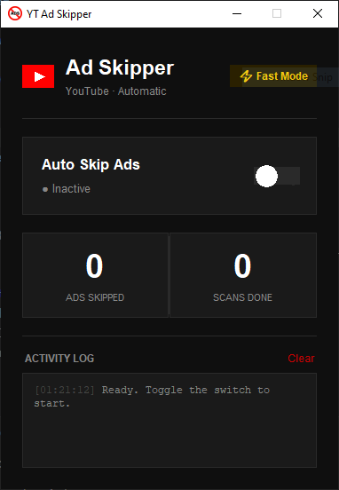

# 📺 YouTube Ad Skipper

A lightweight desktop tool that **automatically detects and clicks the Skip Ad button** on YouTube — the moment it appears. Built with Python, it runs silently in the background while you watch, using OCR to scan the screen and click Skip without any browser extensions or API access required.

---

## ✨ Features

- 🔍 Continuously scans the screen for the Skip button
- ⚡ Parallel OCR across 5 image versions for fast detection
- 🖱️ Clicks instantly, then moves mouse back to screen center
- ⏱️ 1-second cooldown after each click to avoid double-clicks
- 🎛️ Clean GUI with live stats and activity log
- 🔁 Runs infinitely until you toggle it off

---

## 🖥️ Preview



---

## 🧩 Dependencies

| Dependency        | Purpose                                 |
| ----------------- | --------------------------------------- |
| **Python 3.8+**   | Runtime                                 |
| **Tesseract OCR** | Text detection engine (external binary) |
| `pyautogui`       | Screen capture & mouse control          |
| `pytesseract`     | Python wrapper for Tesseract            |
| `opencv-python`   | Image preprocessing                     |
| `Pillow`          | Image handling                          |
| `numpy`           | Array operations for image data         |

---

## 📦 Installation

### Step 1 — Clone the repository

```bash
git clone https://github.com/your-username/yt-ad-skipper.git
cd yt-ad-skipper
```

---

### Step 2 — Install Tesseract OCR

Tesseract is an external OCR engine that must be installed separately before the Python packages.

---

#### 🪟 Windows

**1. Download the installer**

Go to: [https://github.com/UB-Mannheim/tesseract/wiki](https://github.com/UB-Mannheim/tesseract/wiki)

Download the latest 64-bit installer — the filename looks like:

```
tesseract-ocr-w64-setup-5.x.x.exe
```

**2. Run the installer**

- Double-click the downloaded `.exe`
- Click **Next** on all screens — keep all default options
- Default install path: `C:\Program Files\Tesseract-OCR\`
- Click **Install**, then **Finish**

**3. Add Tesseract to your system PATH**

> This lets you run `tesseract` from any terminal.

- Press `Win + R`, type the following, and press Enter:
  ```
  rundll32 sysdm.cpl,EditEnvironmentVariables
  ```
- In the **System variables** panel (bottom half), find the variable named `Path`
- Double-click `Path`
- Click **New**
- Paste this:
  ```
  C:\Program Files\Tesseract-OCR
  ```
- Click **OK** → **OK** → **OK** to close all windows

**4. Verify the install**

Close any open terminals, open a new one, and run:

```bash
tesseract --version
```

✅ Expected output:

```
tesseract 5.5.0
 ...
```

❌ If you see `'tesseract' is not recognized` — the PATH was not saved correctly. Repeat step 3 and make sure to open a **new** terminal window after.

**5. Confirm the path in the script**

Open `ad_skipper.py` and make sure this line matches your install location:

```python
pytesseract.pytesseract.tesseract_cmd = r"C:\Program Files\Tesseract-OCR\tesseract.exe"
```

If you installed to a different location, find the correct path by running:

```bash
where tesseract
```

---

#### 🍎 macOS

```bash
brew install tesseract
```

Verify:

```bash
tesseract --version
```

---

#### 🐧 Linux (Ubuntu / Debian)

```bash
sudo apt update
sudo apt install tesseract-ocr
```

Verify:

```bash
tesseract --version
```

---

### Step 3 — Install Python dependencies

All Python packages are listed in `requirements.txt`. Install them with one command:

```bash
pip install -r requirements.txt
```

Or manually if preferred:

```bash
pip install pyautogui pytesseract opencv-python Pillow numpy
```

> **Note:** `tkinter` (used for the GUI) is built into Python on Windows and macOS. On Linux, install it separately if needed:
>
> ```bash
> sudo apt install python3-tk
> ```

---

## 📦 Build a Standalone `.exe` (Windows)

You can package the app into a single clickable `.exe` file that runs without needing Python installed.

### Step 1 — Install PyInstaller

```bash
pip install pyinstaller
```

### Step 2 — Prepare your icon

Make sure you have an `icon.ico` file in your project folder. If you only have a `.png`, convert it to `.ico` using an online tool like [icoconvert.com](https://icoconvert.com) or [convertio.co](https://convertio.co).

Your project folder should look like this before building:

```
yt-ad-skipper/
├── ad_skipper.py
├── icon.ico          ← required for the exe icon
├── requirements.txt
└── README.md
```

### Step 3 — Build the `.exe`

Run this command from inside your project folder:

```bash
pyinstaller --noconfirm --onefile --windowed --icon=icon.ico --add-data "icon.ico;." --name "YT Ad Skipper" ad_skipper.py
```

| Flag                      | What it does                                              |
| ------------------------- | --------------------------------------------------------- |
| `--onefile`               | Packages everything into a single `.exe` file             |
| `--windowed`              | Hides the terminal/console window when the app runs       |
| `--icon=icon.ico`         | Sets the taskbar and file icon                            |
| `--add-data "icon.ico;."` | Bundles the icon inside the `.exe` so it loads at runtime |
| `--name "YT Ad Skipper"`  | Sets the output filename                                  |
| `--noconfirm`             | Skips overwrite confirmation if a previous build exists   |

### Step 4 — Find your `.exe`

After the build finishes, your executable will be at:

```
dist/YT Ad Skipper.exe
```

Double-click it to run — no Python, no terminal needed.

> **Note:** Windows Defender or antivirus software may flag the `.exe` the first time. This is a false positive common with PyInstaller-built apps. You can safely click "Allow" or add an exclusion.

### Clean up build files (optional)

PyInstaller generates some extra folders you don't need to keep:

```bash
rmdir /s /q build
del "YT Ad Skipper.spec"
```

The only file you need to distribute is `dist/YT Ad Skipper.exe`.

---

## ▶️ Running the Program

```bash
python ad_skipper.py
```

The GUI window will open. Click the toggle switch to start — the skipper runs in the background from that point on.

**To stop:** click the toggle again, or close the window.

---

## ⚙️ Configuration

You can tweak these variables at the top of `ad_skipper.py`:

```python
SCAN_INTERVAL        = 0.1   # Seconds between scans (lower = faster)
CONFIDENCE_MIN       = 30    # OCR confidence threshold (0–100)
CLICK_COOLDOWN       = 1.0   # Seconds to wait after a click before next scan
DELAY_BETWEEN_CLICKS = 0.3   # Seconds between multiple simultaneous matches

# Screen zone to scan (bottom-right of screen where Skip button appears)
SEARCH_ZONE_LEFT   = 0.50
SEARCH_ZONE_TOP    = 0.50
SEARCH_ZONE_RIGHT  = 1.00
SEARCH_ZONE_BOTTOM = 1.00
```

---

## 🛡️ How It Works

1. Every `0.1s`, it captures the **bottom-right 50% of your screen** (where YouTube's Skip button always appears)
2. The captured image is preprocessed into **5 versions** (grayscale, inverted, thresholded, sharpened, etc.)
3. All 5 versions are scanned with Tesseract OCR **in parallel** using threads
4. If any version detects a valid Skip button word (`Skip`, `Skip Ad`, `Skip Ads`, `Skip in X`), it clicks immediately
5. After clicking, the mouse moves to the **center of the screen** so it doesn't hover over the video
6. A **1-second cooldown** prevents double-clicking the same button

---

## ❓ Troubleshooting

**Skip button not detected?**

- Lower `CONFIDENCE_MIN` from `30` to `20`
- Make sure your browser zoom is at 100%
- Widen the scan zone by lowering `SEARCH_ZONE_LEFT` and `SEARCH_ZONE_TOP`

**Clicking wrong buttons?**

- Raise `CONFIDENCE_MIN` to `50` or higher
- Narrow the scan zone by raising `SEARCH_ZONE_LEFT` / `SEARCH_ZONE_TOP`

**`TesseractNotFoundError`?**

- Tesseract is not installed or the path in `ad_skipper.py` is wrong
- Run `where tesseract` in your terminal and copy that path into the `tesseract_cmd` line

**Mouse goes to wrong position?**

- Make sure your display scaling is set to 100% in Windows display settings
- If you use multiple monitors, the Skip button must be on the primary display
